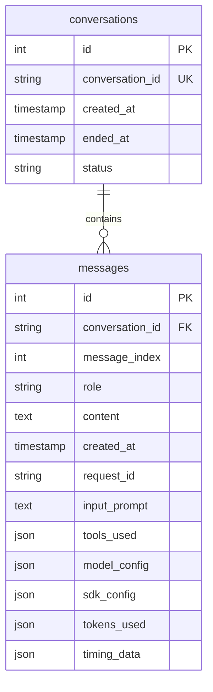
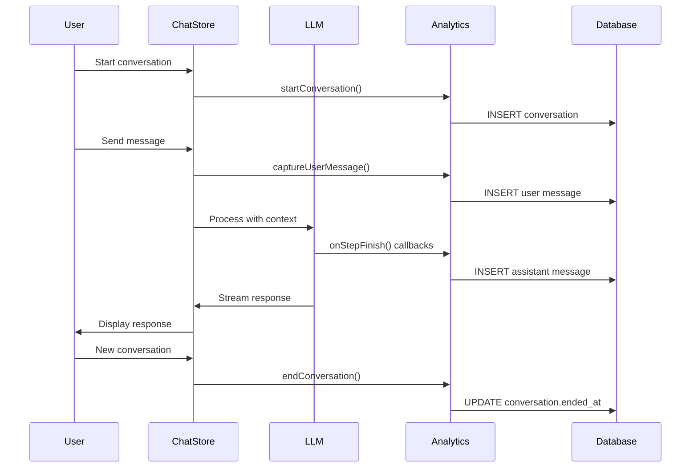

# Conversation Analytics System

## Problem Statement

The Robo Mom project needs a comprehensive system to capture and store all LLM interactions for analysis and debugging purposes. This is separate from the existing logging infrastructure, which is designed for short-term debugging and system monitoring.

### Core Requirements

The system must capture for each LLM interaction:
- **Initial Input**: Complete prompt, available tools, model configuration, AI SDK settings
- **LLM Response**: Full response text, token usage, timing data
- **Multi-Step Interactions**: Tool calls, tool responses, subsequent LLM inputs
- **Conversation Context**: Group related interactions with unique identifiers
- **Long-term Storage**: Persistent, queryable data for future analysis

### Success Criteria

1. Complete capture of all LLM interactions without affecting chat performance
2. Structured, queryable data for analysis and debugging
3. Foundation for future conversation history features
4. Graceful error handling that never breaks the chat experience
5. Clear separation from existing logging infrastructure

## Solution Design

### Architecture Overview

The solution implements a database-based analytics system using:
- **PGlite Database**: Existing file-based PostgreSQL with new analytics tables
- **Drizzle ORM**: Consistent with existing database patterns
- **AsyncLocalStorage**: Conversation and request ID tracking
- **Vercel AI SDK Hooks**: Integration points for data capture

### Data Model



### Context Management

The system extends the existing request context pattern with conversation-level tracking:

```typescript
// Request Context (existing)
const requestIdStorage = new AsyncLocalStorage<string>();
// - Scope: Single LLM request-response cycle
// - Used for: Logging correlation, debugging

// Conversation Context (new)
const conversationIdStorage = new AsyncLocalStorage<string>();
// - Scope: Entire user conversation session
// - Used for: Analytics grouping, conversation history
```

### Integration Points

The system hooks into existing Vercel AI SDK callbacks:

1. **Request Initiation**: Capture conversation start and initial configuration
2. **onStepFinish**: Capture individual step data, tool calls, token usage
3. **onFinish**: Capture final response and conversation metrics
4. **onError**: Capture error conditions and partial data

## Database Schema

### Conversations Table

Tracks conversation lifecycle and metadata:

```sql
CREATE TABLE conversations (
    id SERIAL PRIMARY KEY,
    conversation_id TEXT UNIQUE NOT NULL,
    created_at TIMESTAMP DEFAULT NOW(),
    ended_at TIMESTAMP,
    status TEXT DEFAULT 'active'
);
```

### Messages Table

Stores individual messages with complete analytics data:

```sql
CREATE TABLE messages (
    id SERIAL PRIMARY KEY,
    conversation_id TEXT NOT NULL REFERENCES conversations(conversation_id),
    message_index INTEGER NOT NULL,
    role TEXT NOT NULL, -- 'user' | 'assistant'
    content TEXT NOT NULL,
    created_at TIMESTAMP DEFAULT NOW(),

    -- Assistant-specific analytics (NULL for user messages)
    request_id TEXT,
    input_prompt TEXT,
    tools_used JSONB,
    model_config JSONB,
    sdk_config JSONB,
    tokens_used JSONB,
    timing_data JSONB,

    UNIQUE(conversation_id, message_index)
);
```

## Implementation Architecture

### Core Components

1. **Conversation Context** (`src/context/conversation-context.ts`)
   - AsyncLocalStorage for conversation ID tracking
   - Lifecycle management functions
   - Integration with existing request context

2. **Analytics Service** (`src/analytics/conversation-analytics.ts`)
   - Centralized data capture API
   - Error handling and graceful degradation
   - Database operations using Drizzle ORM

3. **Chat Store Integration** (`src/ui/chat/store.ts`)
   - Conversation lifecycle management
   - User message capture
   - Context propagation to LLM calls

4. **LLM Integration** (`src/llms/chat-completion.ts`)
   - AI SDK callback integration
   - Assistant message capture with analytics
   - Tool call data extraction

### Data Flow



## Features

### Analytics Capture

**User Messages**:
- Message content and timestamp
- Sequence index in conversation
- Conversation and request context

**Assistant Messages**:
- Complete response text and metadata
- Full input prompt (system + conversation history)
- Tool calls with arguments (results inferable from subsequent prompts)
- Model configuration (provider, model ID, parameters)
- SDK configuration (maxSteps, temperature, etc.)
- Token usage and timing data
- Error information (if applicable)

### Conversation Management

**Lifecycle Tracking**:
- Conversation start/end timestamps
- Status tracking (active, ended, abandoned)
- Automatic context propagation

**Message Sequencing**:
- Clear ordering with message_index
- Proper conversation reconstruction
- Support for multi-turn interactions

### Development Tools

**Analytics CLI** (`pnpm run analytics:cli`):
- List recent conversations
- Display full conversation history
- Analytics summaries and statistics
- Database querying interface

### Error Handling

**Graceful Degradation**:
- Analytics failures logged but don't break chat
- Partial data capture in error scenarios
- Robust error recovery mechanisms

**Monitoring**:
- Analytics operation success/failure tracking
- Performance impact monitoring
- Data integrity verification

## Usage Examples

### Querying Analytics Data

```typescript
// Find recent conversations
const conversations = await db
  .select()
  .from(conversationsTable)
  .orderBy(desc(conversationsTable.created_at))
  .limit(10);

// Get full conversation with messages
const conversation = await db
  .select()
  .from(messagesTable)
  .where(eq(messagesTable.conversation_id, conversationId))
  .orderBy(messagesTable.message_index);

// Analyze tool usage
const toolUsage = await db
  .select({
    tool: sql`tools_used->>'toolName'`,
    count: sql`count(*)`
  })
  .from(messagesTable)
  .where(isNotNull(messagesTable.tools_used))
  .groupBy(sql`tools_used->>'toolName'`);
```

### CLI Operations

```bash
# List recent conversations
pnpm run analytics:cli list-conversations

# Show specific conversation
pnpm run analytics:cli show-conversation abc123

# Analytics summary
pnpm run analytics:cli stats
```

## Future Enhancements

### Conversation History Feature

The analytics schema directly supports implementing conversation history:
- Load previous conversations from database
- Resume conversations by conversation_id
- Search across conversation history
- Export/import conversation data

### Advanced Analytics

- Token usage analysis and cost tracking
- Tool effectiveness metrics
- Response quality indicators
- Performance optimization insights

### External Integration

- Export to external analytics platforms
- Real-time analytics dashboards
- Automated insight generation
- A/B testing framework for prompts

## Configuration

### Environment Variables

```bash
# Database configuration (existing)
DATABASE_DIR=./data
```

**Note**: The conversation analytics system is always enabled and does not require additional configuration.

### Performance Considerations

- **Database Impact**: Minimal - PGlite handles analytics data efficiently
- **Memory Usage**: Low - asynchronous operations, no buffering
- **Chat Performance**: No measurable impact - non-blocking operations
- **Storage Growth**: ~10-50KB per conversation, manageable for typical usage

## Maintenance

### Data Management

- **Retention**: No automatic cleanup - data kept indefinitely
- **Backup**: Included in existing database backup procedures
- **Migration**: Standard Drizzle migration process
- **Monitoring**: Built into existing logging infrastructure

### Troubleshooting

**Common Issues**:
- Analytics capture failures → Check database connectivity
- Missing conversation context → Verify AsyncLocalStorage setup
- Performance impact → Review async operation patterns

**Debugging Tools**:
- Enhanced logging with conversation context
- Analytics CLI for data verification
- Database queries via existing db-cli tool

## Security Considerations

### Data Privacy

- **Sensitive Information**: User messages and LLM responses stored as-is
- **Access Control**: Database-level security via file system permissions
- **Audit Trail**: Complete interaction history for compliance
- **Data Sanitization**: Not implemented - consider for production use

### Recommendations

- Review conversation data for sensitive information
- Implement data retention policies if required
- Consider encryption for sensitive deployments
- Regular security audits of analytics data

## Implementation Status

This system provides a comprehensive foundation for LLM interaction analytics while maintaining the simplicity and performance characteristics of the Robo Mom application. The design supports both immediate analysis needs and future conversation history features.